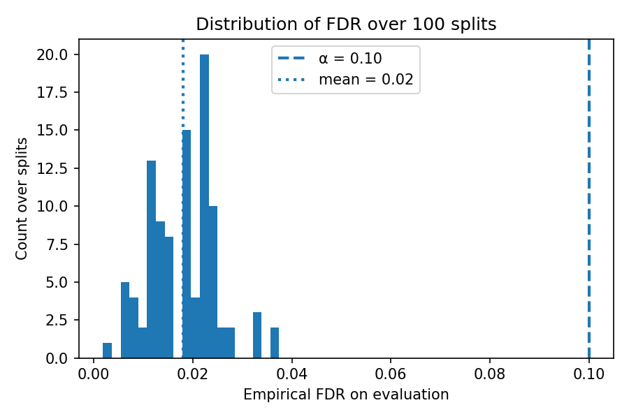
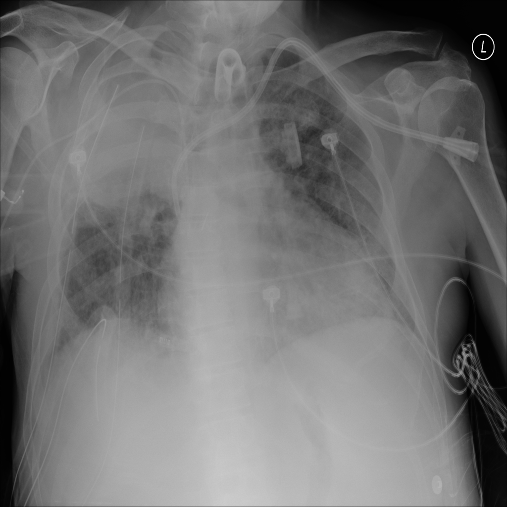
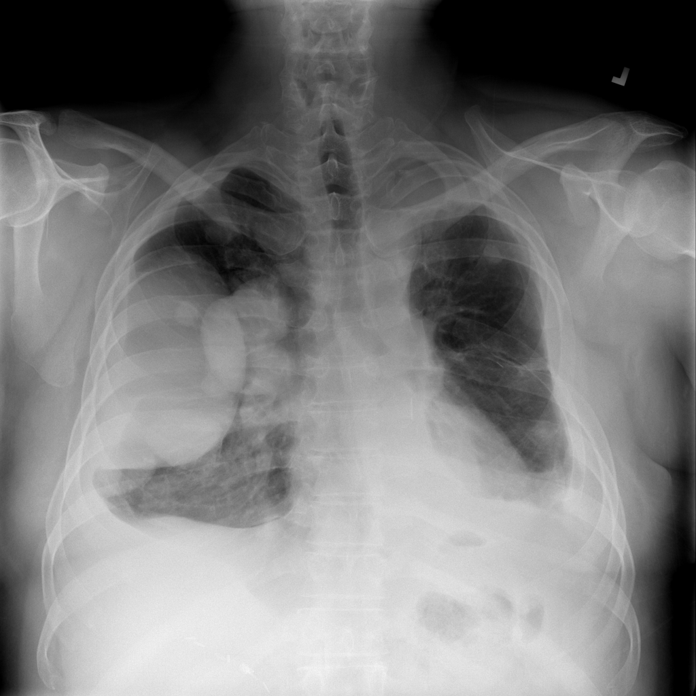

# risk_control_conformal

This folder implements **distribution-free risk control** (Learn-Then-Test / LTT) for **multi-label prediction sets** on top of the upstream NIH Chest X-ray classifier in `../upstream_xray_classifier`.

## Credits
- Upstream baseline adapted from: https://github.com/n0obcoder/NIH-Chest-X-Rays-Multi-Label-Image-Classification-In-Pytorch  


## What’s inside
- `risk_control.py` — LTT experiment to select a threshold $\lambda$ that controls **FDR**:
  - prediction set: $T_\lambda(x)=\{k:\hat p_k(x)>\lambda\}$
  - loss (FDP): $\mathrm{FDP}(T,Y)=1-\frac{|T\cap Y|}{|T|}$ (0 if $|T|=0$)
  - runs multiple random calibration/evaluation splits and plots the distribution of empirical FDR.
- `predict_one_image.py` — predict disease probabilities for a single X-ray image.
- `utils.py` — shared utilities (load checkpoint, dataset access, preprocessing).
- `results/` — generated outputs (histogram + saved images).

---

## LTT FDR experiment with Bonferroni correction (from `classification/`)

**Key args:**
-- alpha target FDR (default 0.10)
-- delta failure probability (default 0.10)
-- calib_frac calibration fraction (default 0.5)
-- num_splits between validation and test sets for the experiment (default 100)
```bash
bash scripts/run_fdr.sh
```
Results are stored in 

---

## Single image prediction (from `classification/`)

Put an image into upstream_xray_classifier/data/xrays_to_predict/, then use **run_predict_image.sh** script from ***scripts**, specifying needed image name:
```bash
bash scripts/run_predict_image.sh
```

---

## Results

With the default parameters, we obtain the following empirical distribution of FDR across random splits. As expected from the theory, the guarantee is **one-sided**: the probability of violating the target risk level is bounded by $\delta$. In our run, **fewer than 10%** of splits exceed the target FDR level $\alpha=0.10$, which is consistent with the LTT risk-control guarantee.

Using a **Bonferroni correction** over the $\lambda$-grid (to control family-wise error across multiple tested thresholds) makes the procedure **more conservative**: fewer violating splits, but typically a **larger** selected threshold (here, approximately $\lambda^\*\approx 0.75$), which reduces the size of predicted label sets $T_\lambda(x)$.

### Empirical FDR over splits



### Example multi-label predictions

Below are two example X-rays saved from the last split where the prediction set contained more than one label. The filenames encode the predicted labels:

- **Predicted labels:** `Consolidation` + `Infiltration`



- **Predicted labels:** `Mass` + `Pleural_Thickening`


